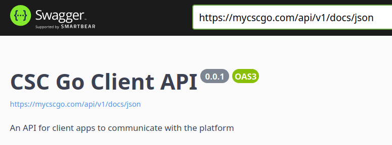
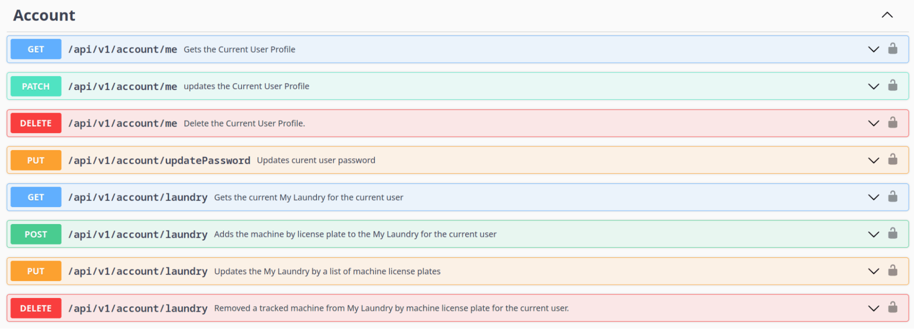
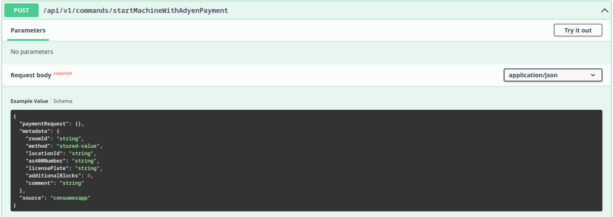
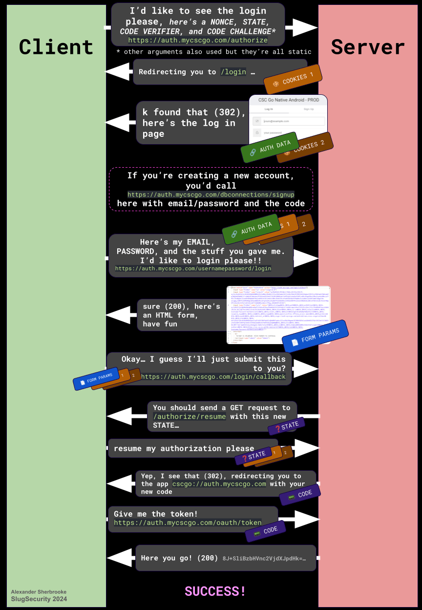
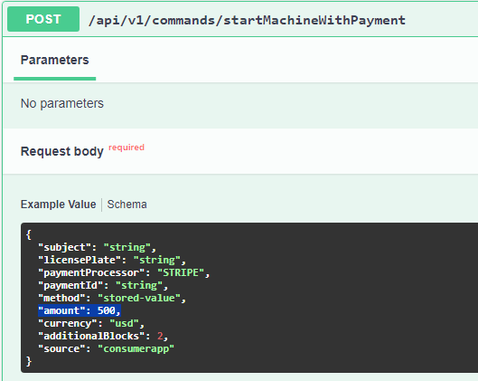
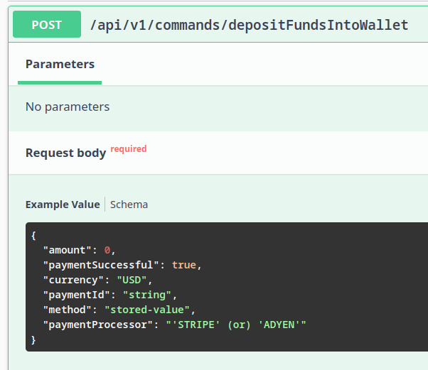
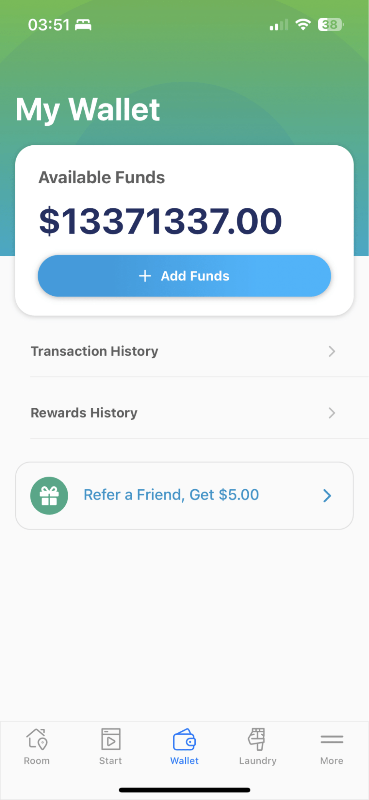

This is a more technical continuation of the [article we had with TechCrunch on the machines we found security flaws in](https://techcrunch.com/2024/05/17/csc-serviceworks-free-laundry-million-machines/). Not every day do you pwn the largest commercial network of laundry appliances in the United States! This article is purely educational and to inspire any future security researchers who want to investigate everyday products they use.

<!-- more -->

For any developers out there, we have a simple message for you:


!!! note "Disclosure Notice"
	This research was done in good faith. Originally discovered in January of 2024, we’ve attempted to contact the vendor multiple times over the span of 5 months with no sign of a response. In addition, proper disclosure was made to the [CERT Collaboration Center](https://kb.cert.org), with a public disclosure date of late March.

## Initial Snooping
So, what started all of this? Best way to describe it is why we do anything: boredom and curiosity. We find it fascinating to see how people (or companies) build out these types of systems, and hey, maybe there's some interesting logic going on behind the scenes. It’s fun to take apart some of the apps we use every day and envision how we can make them better. Alex was personally trying to make an app as a side project to track the status of laundry machines on campus - and perhaps, maybe we’d find an interesting story to tell.

As it turns out, we found a *lot* more than we’d expected.

## Investigating the API
After skimming through the requests the web client was making, we saw a pattern with the endpoint structure. Surely they wouldn’t have any public facing API docs for a closed source app, right? Turns out, CSC had made this exact mistake, and boy, did it give us a lot of information. By simply adding `/api/v1/docs` to their website URL, you could uncover [an instance of Swagger UI (now taken down)](https://web.archive.org/web/20240120071238/https://mycscgo.com/api/v1/docs/static/index.html#/), a frontend for viewing and testing API endpoints. Looking into the docs, we found every single API endpoint the app could call, and more importantly, what parameters each endpoint required.



Immediately you can see some interesting API endpoints:




And due to the nature of the documentation engine they used, we get a nice view of what each endpoint requires for a successful interaction. Here's an example:



Of course, most of the endpoints we’re interested in require an account token (a piece of data that authenticates actions on your account), obtained from logging into a CSC GO account. So, how do we generate an account token?

## Understanding Auth0
CSC Go uses Auth0 for authentication, and you’re redirected to their hosted endpoint (auth.mycscgo.com) whenever you try to log in on the app. Their login flow follows the modern standards of [OAuth2](https://www.oauth.com/), securely exchanging login credentials and other app data through a 3-step handshake. Using request skimming tools like [HTTP Toolkit](https://httptoolkit.com/), we can monitor the requests the app makes when signing in on an account, and emulate them with a script.

Compiling it all together, it looks a little something like this:



Note that the nonce, state, code verifier, and code challenge supplied to the login page by the client to ensure nothing funny happens to the requests ([see the OAuth2 specification](https://www.oauth.com/oauth2-servers/pkce/authorization-request/)). So, they can essentially be anything we want.

Figuring out the login flow is the only real barrier to entry to exploiting this vulnerability – and it’s security through obscurity!

## Let’s Start a Machine!
Right away, we noticed the `startMachineWithPayment` endpoint in the API docs. At first, we thought the app was just sending a signal to the server to request that machine be started with the specified payment method (in this case, the account funds). After all, that’s the sensible thing to do, right?

Then, we noticed an `amount` parameter in the request...



So... what happens if you run the machine with `amount` set to 0?

<div style="position: relative; padding-bottom: 56.25%; height: 0;">
	<iframe style="position: absolute; top: 0; left: 0; width: 100%; height: 100%;" src="https://www.youtube.com/embed/yXTj9JzYOrE" frameborder="0" allowfullscreen></iframe>
</div>

...yeah.

As it turns out, the app queries `machine/info/{GUID}` before each run, with “GUID” being the machine’s ID. Then, the client checks if the account has enough funds before sending the request. The server just assumes that’s already been done, and that the client is telling the truth about how much money the machine costs, so it rolls ahead and starts the machine.

Where’s that image again?


## Generating Funds
In addition to being able to call commands to interface with machines, we’re also able to mess with the user account. Through the API, we figured out that there's no authentication to the money you deposit. So you can just tell CSC’s servers “I deposited 13 million into my account and it was a success” and you’ll get a thumbs up from their server.

Here you can see an example of the type of data the servers wanted, note the `paymentSuccessful` parameter that’s for some reason controlled by the client when you make a deposit:



So what does that look like in action? Well, see for yourself:


Basically passing in the following information (and our account’s authentication token). Yes, everything other than the amount is useless, including the obscure `paymentId` and `paymentProcessor`:

```json
{
  "amount": 1337133700,
  "paymentSuccessful": true,
  "currency": "USD",
  "paymentId": "string",
  "method": "stored-value",
  "paymentProcessor": "'STRIPE' (or) 'ADYEN'"
}
```

We get this amazing result:

{ width="50%" }

And for those scared by seeing such a large amount of money next to a dollar sign, it's not real. You can’t do much with this other than pay for laundry. Yes, I’ve become the first generational laundry millionaire, no, I cannot buy a house with it. 

We’ve noticed that giving yourself such large amounts of laundry bucks™ must cause some confusion when a financial analyst is looking at the state of the economy for their laundry ecosystem, since we had the money taken away 3 days later:

{ width="60%" }

Injecting more realistic amounts such as $50 or $100, however, seems to fly under their radar. Our test transactions with smaller denominations are still present 5 months later.

Other than this, we can mess with other account details such as exfiltrating billing information not normally exposed in the app, but that’s not too impressive given you need to know the login details of the given account.

## Why We Waited So Long
When we found out about this misconfiguration/vulnerability, we wanted to make sure we went through the proper channels. It's pretty understandable that we don’t want a multi-million dollar company throwing a lawsuit at us because we didn’t report it. So, for months we tried sending emails, phone calls, support tickets… with no response. We even got the help of CMU’s CERT Coordination Center to try and contact them, but they didn’t even visit CERT’s portal to view the message.

Additionally, we had another concern regarding the physical appliances themselves. You may know that a dryer or washing machine takes quite a lot of power, so having the ability to not only start the machines remotely, but also enumerate machines, building out a directory of all the interconnected machines on the network gave us a bit of a fright. There’s obviously some fear in a million or so laundry appliances all turning on at once. But after some testing, we found that at most you can only “pre-start” a cycle; you still have to be there in-person to fully start the machine. So in the end, our fears about stressing the already weak power grid were unfounded. For any concerns regarding overheating (such as adding time to cycles repetitively), the machines we’ve seen on our campus have built-in temperature limit switches – most likely no risk of fires there, and if there were any, that's on the appliance manufacturers.

## Proof of Concept
At this time, we don’t feel it’s ethical to publish our proof of concept scripts while these vulnerabilities are still in the production API. We’re not looking to cause chaos at CSC ServiceWorks. However, there’s enough information here for someone knowledgeable in simple web reversing to figure out how to snatch their authentication token from the app, or to generate their own Auth0 token. Everything past that is as simple as calling the API using curl. We’ll leave that as an exercise for the reader :^)

## Takeaways
This whole journey was pretty fun for us, especially working with TechCrunch to make a cool article and disclose a serious vulnerability. We’ve been called everything from “security researchers” and “cyber criminals” for our work! It really says something about the current state of IoT and cybersecurity, where most issues come from misconfigurations (or lack of secure design) and not from these insane zero days we sometimes hear about. Hopefully, companies like CSC ServiceWorks learn that they should tell an intern or one of their software engineers (if they even have them) to simply set up a monitored inbox and a [security.txt](https://securitytxt.org/) page so people can, in good faith, contact them about security issues. 

And if anyone at CSC ServiceWorks is reading this... let us know if you need help with that.