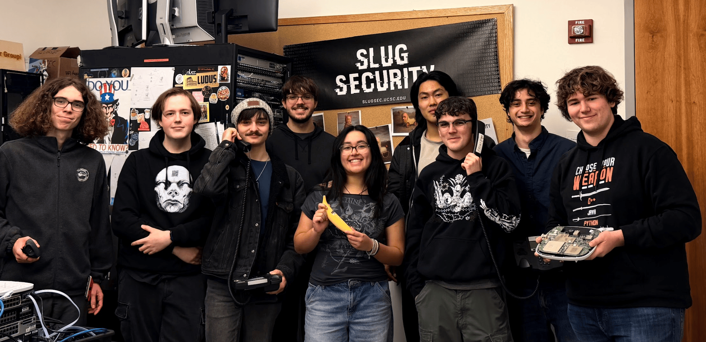

!!! quote "Reposted from UCSC ITS News"
	This article was originally written and published by UCSC Information Technology Services on March 3, 2026. Read the original at [its.ucsc.edu](https://its.ucsc.edu/its-news/the-next-generation-of-cyber-defenders/). Reproduced here with full credit to the original authors.

On a typical Saturday in Baskin Engineering, UCSC students are catching up on homework or studying for exams. But on February 7, one room told a very different story. Eight students sat at the helm of a live IT command center, managing a complex network while fending off relentless simulated cyberattacks. For Slug Security, this was just another day on the job.

<!-- more -->

[**Slug Security**](https://slugsec.ucsc.edu/) is a student-run organization under Baskin Engineering faculty oversight, focused on all aspects of computer security. This year, the team took on the [**Collegiate Cybersecurity Defense Competition** (CCDC)](https://www.nationalccdc.org/), a day-long simulation that mirrors the real demands of a career in IT. The pressure was on, and they delivered. Slug Security earned **5th place** out of 28 schools, securing a spot at the Regional Finals at Cal Poly Pomona this March.

## From college to career

This success is part of a larger mission for the club. Founded in 2022 by senior and club President **Ex Taranenko**, Slug Security provides hands-on experience that a standard classroom setting can't always offer.

> "We wanted a community built around the practical side of computer security and operations," Taranenko says.

With the Slug Security community, these students have created their own pipeline into the professional industry.

**Brian Hall**, the Associate Vice Chancellor for Information Security at UCSC, served as a judge for the recent competition, and noted that an important component was the exposure to real life professional IT settings.

> "They are going to leave UC Santa Cruz with more than just a degree," said Hall. "They'll have documented experience in a partnership with the CISO's (Chief Information Security Officer) office and a track record of success in industry-level competitions. It feeds directly into career readiness."

The club also highlights the variety of roles available in the technology sector. Slug Security Vice President **Peter Dobbins** explains that the field is much broader than people realize. "Cybersecurity is a really broad topic with many different aspects, and the club does a great job of covering those through competitions and projects," Dobbins said.

Beyond technical skills, the club acts as a bridge between student life and institutional leadership. Freshman Slug Security member **Morris Richman** took the initiative to build a relationship with the university's Information Technology Services (ITS) department, proving that these students are already thinking like career professionals.

## Why it matters

The CCDC and similar competitions arm students with the skills they need to navigate the high-stakes pressure of a real IT job, and also showcase the importance of cybersecurity defense.

> "The students lived it. They realized that in the real world, you don't always get to be the cool hacker from the movies; you're the defense. And we need smart people on defense," Hall said.

Slug Security emphasizes that cybersecurity is relevant to everyone, and encourages students from all majors to bring their unique perspectives to the table. In today's job market, a degree is often just the baseline, and the real advantage comes from experience. These students are proving you don't need a formal concentration or computer science degree to be a professional, just the confidence and community to seek out your own challenges. By simulating the stressful workdays of the tech world today, they are ensuring that they are ready to lead the industry tomorrow.
